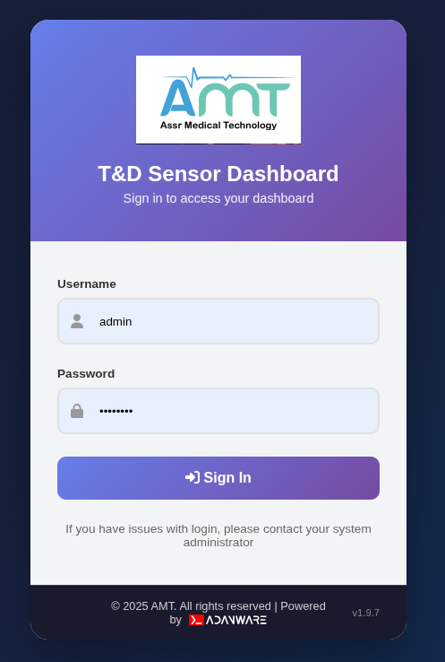
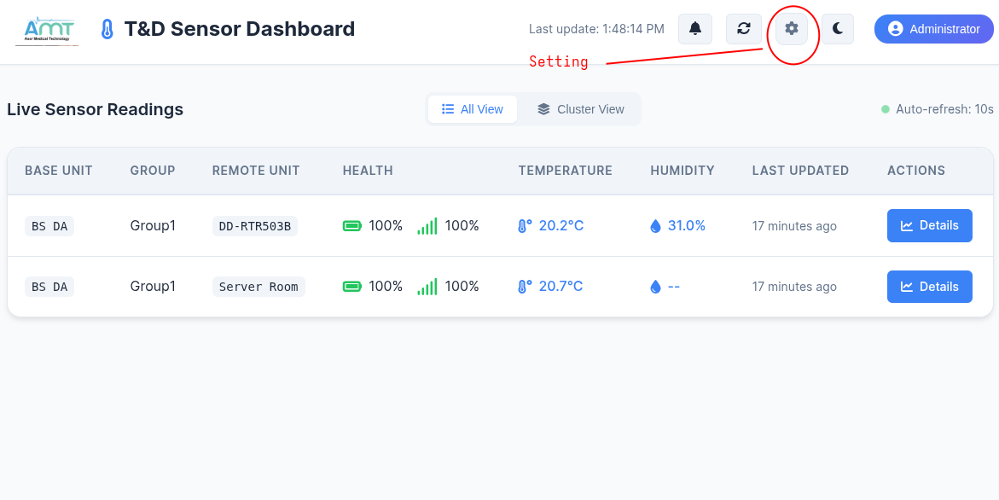
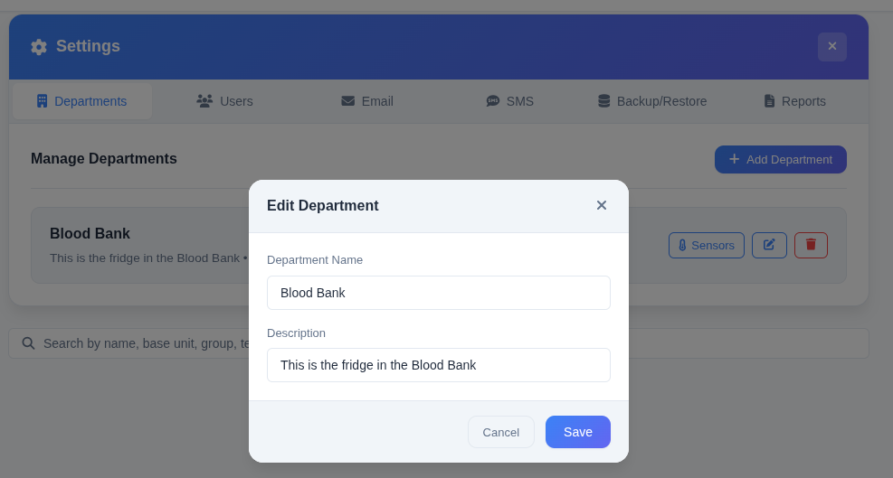
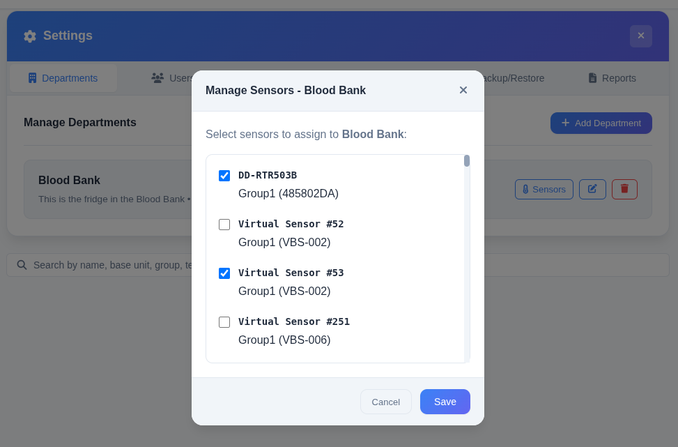
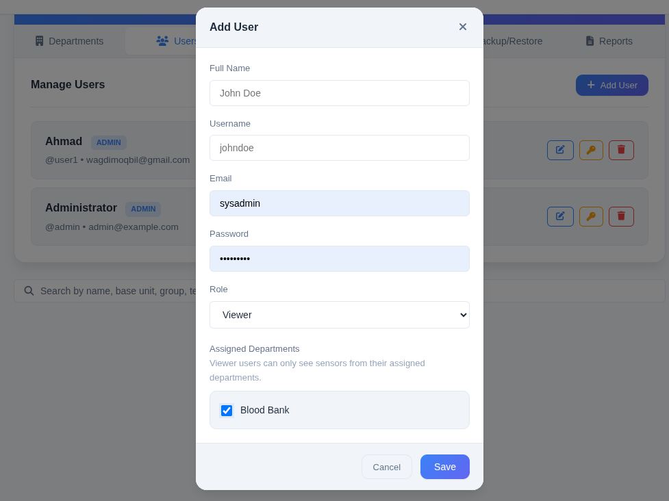
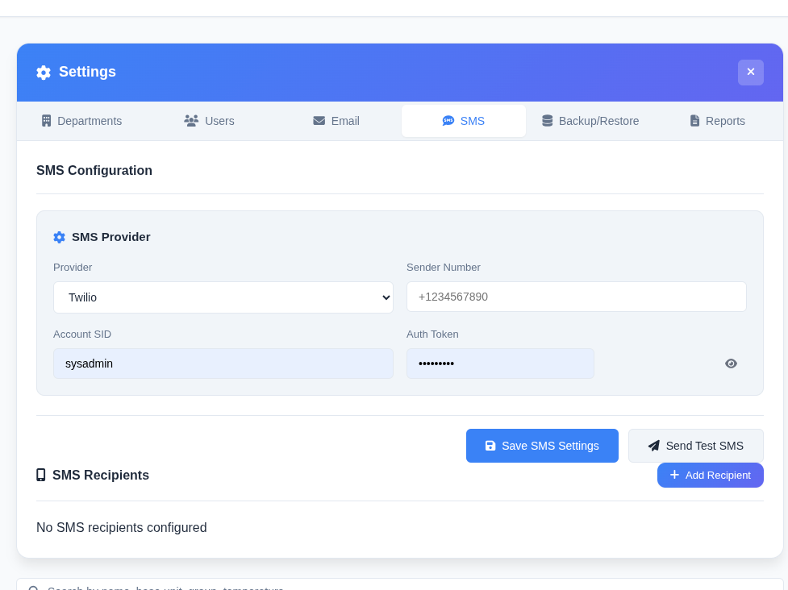
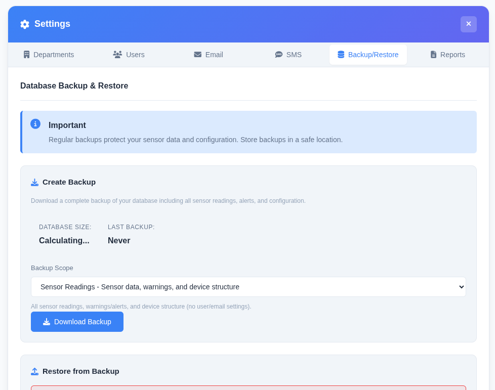
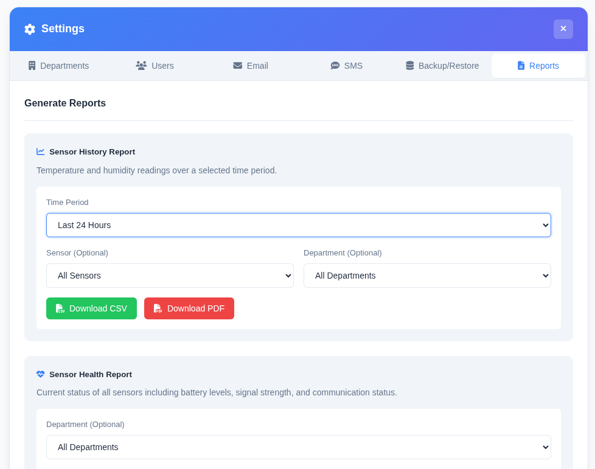

# System & TandD Base Station Setup Guide

> **Prerequisite:**  
> This session can be started **only after** you complete the deployment session successfully.  
> Do not proceed unless deployment is fully verified.

---

## Overview

This guide covers the setup and configuration of two main components:

1. **TandD Base Station** – Hardware setup and network configuration  
2. **System Dashboard** – Application configuration and device integration

---

## 1. TandD Base Station Setup

### 1.1. Installing the Software

- [ ] Dwonload RTR500BW for Windows from the T&D Website and install it to your PC.
    * Do not connect the Base Unit to your computer until the software has been installed.

    
        tandd.com/software/rtr500bwwin.html

### 1.2. Making Initial Settings for the Base Unit
- [ ] Open RTR500BW for Windows, and then open RTR500BW Settings Utility.
- [ ] Connect the Base Unit with the supplied AC adaptor to a power source.
- [ ] Connect the Base Unit with the supplied USB cable to your computer.
        * The USB driver installation will start automatically.
        * When the USB driver installation is completed, the RTR500BW settings window will automatically open.
- [ ] Enter the following information in the [Base Unit Settings] window.
---

|  |   |
| -------------------- | ------------------------------------------------------ |
| Base Unit Name       | Assign a unique name for each Base Unit |
| Connection  Password     |  Enter a password here for connecting to the Base Unit via Bluetooth or LAN. |

The factory default password is "password".
        
---

### 1.3 Making Initial Settings for the Base Unit
- [ ] Open RTR500BW for Windows, and then open RTR500BW Settings Utility.
- [ ] Connect the Base Unit with the supplied AC adaptor to a power source.
- [ ] Connect the Base Unit with the supplied USB cable to your computer.
        • The USB driver installation will start automatically.

## 2. Configure T&D Base Station for AMT-T&D Software

After deploying the AMT-T&D software, you need to configure the Base Station to send readings to the server.

### 2.1. Open RTR500WB Settings Utility
- [ ] Install/Open the **RTR500WB Settings Utility** on any Windows computer connected to the same network as the Base Station.

### 2.2. Connect to Base Station
- [ ] Click on the **Operation** tab → **Search Network**.
- [ ] You should see your Base Station listed. **Double-click** on it.
- [ ] Enter the Base Station password when prompted and click **OK**.

### 2.3. Configure Server Settings
- [ ] In the settings window, go to **HTTP(s) Settings**.
- [ ] **Connection Destination:** Choose `Custom`.
- [ ] **HTTP(s) Server:** Enter the IP address or hostname where the AMT-T&D software is deployed (e.g., `192.168.1.xxx`).
- [ ] **HTTP(s) Port Number:** `80`
- [ ] **Destination Path:** `/api/rtr500/device/`
- [ ] **Secure Connection:** `OFF` (Turn ON only if you have configured HTTPS/SSL).
- [ ] **Connection Interval:** `5 minutes` (or your preferred interval).
- [ ] Click **Apply** to save the configuration.

### 2.4. Test Connection
- [ ] Click on the **Transmission Test** tab (or button).
- [ ] Click **"Test transmission of the current readings"**.
- [ ] You should see a success message, indicating the connection between the Base Station and the AMT-T&D software is working.

### 2.5. Repeat for Multiple Base Stations
- [ ] If you have more than one Base Station, repeat steps **2.1 through 2.4** for each unit.

---

## 3. System Dashboard Configuration

### 3.1. Access the Dashboard
- [ ] Ensure the System Dashboard application is running (post-deployment).
- [ ] Open the Dashboard URL in a browser.
- [ ] Log in with your administrator credentials.

  

- [ ] Make sure there are some readings data on the dashboard.

  

### 3.2. Departments
- [ ] Navigate to **Settings** → **Departments**..
- [ ] Select `Departments Station` from the top tabs.
- [ ] Enter Departments name.
- [ ] Enter description ( optional).
- [ ] Click **Save**.

  

- [ ] Click **Sensors**.
- [ ] Select sensors to assign to the department you created.
- [ ] Click **Save**.

  

### 3.3. Users
- [ ] Go to **Settings** → **Users**.
- [ ] Select `Users Station` from the top tabs.
- [ ] Click **Add User**.
- [ ] Fill the user details and select the role.
- [ ] Select Department/s from the `Assigned Departments Station` to be assigned to this user.
- [ ] Click **Save**.

  

### 3.4. Email
- [ ] Go to **Settings** → **Email**.
- [ ] Select `Email Station` from the top tabs.

### 3.5. SMS
- [ ] Go to **Settings** → **SMS**.
- [ ] Select `SMS Station` from the top tabs.
- [ ] Fill the  `SMS details` from the SMS provider.

  

### 3.6. Backup and Restore
- [ ] Go to **Settings** → **Backup/Restore**.
- [ ] Select `Backup/Restore Station` from the top tabs.

  

### 3.7. Reports
- [ ] Go to **Settings** → **Reports**.
- [ ] Select `Reports Station` from the top tabs.

  

---

## 4. Troubleshooting Quick Reference

| Issue | Possible Fix |
|--------|----------------|
| Cannot find Base Station in RTR500WB Settings Utility | Ensure Windows PC is on same network; check firewall settings; restart utility |
| Connection test fails | Verify AMT-T&D software is running; check IP address, port 80, and destination path |
| "Secure Connection" errors | Set to OFF unless HTTPS is fully configured on server |
| Dashboard not receiving data | Verify API endpoint URL and credentials; check Base Station transmission logs |
| Alerts not firing | Check threshold values and notification channel configuration |

---
